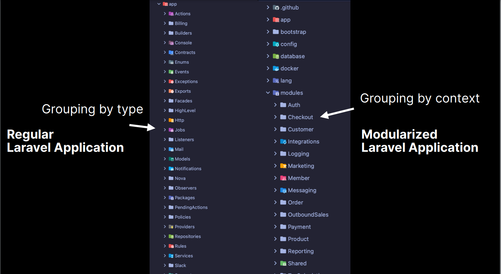

# Unveiling the modular monolith

## What is a Monolith
### The good part

- Everyone knows them
- Simpler infrastructure
- Simple method calls
- Usually one database
- Database Transactions
- One artifact
- Easier to debug

### The bad parts
- Tight coupling between components
- No well-defined boundaries
- Hard to fully understand
- Difficult to maintain
- Hard to onboard

## The modular monolith
- One artifact
- Simple infrastructure
- Database transactional
- Easy to test
- Method calls
- Logical Boundaries
- Low coupling between components
- Indenpendents modules 
- Easier to maintain and scale

## Code organization 
The first step for modularization is to organize your code, trying to decoupling your components, most of this thinking about boundaries and contexts.



By separating by concerns and contexts, we can see that everything stays in it's own location, creating boundaries between those contexts. 

## Cross Boundary Communication
### Useful Guidelines
- Allow modules to be developed indenpendently
- A module should not know about other module's internals
- Incoming messages should be translated into something meaningful to the module's domain
- The producer can have contracts redirect their implementations without the consumer being aware

Let's see some code:
```php
readonly class PendingPayment { 
    public function __construct(
        public string $id, 
        public Token $token,
        public Cents $totalInCents,
        public Gateway $gateway,
        public string $gatewayId
        
    )
    {}
}
```
This is a DTO, or a Data Transfer Object, just an object that represents a bag of data. 

Let's now look at some dirty controller, without boundaries. 

```php
class CheckoutController {
    public function __invoke(CheckoutRequest $request): JsonResponse 
    {
        $items = $request->items(); 
        $total = $this->calculateTotal($items);

        $order = DB::transaction(function () use ($request, $total) {
            $order = $request->user->orders->make(['total' => $total])

            foreach ($items as $item) {
            // Adding a database line for each product
            $order->addLine($item->product, $item->price, $item->quantity);
            // Decreases stock
            $item->product->decreaseStock($item->quantity);
        }

            // Save the order 
            $order->save();
            // charge payment
            $charge = $this->paymentGateway->charge($request->token(), $total);
            $this->createPaymentForOrder($order, $charge);
            // Once it`s done, prepare for shipment
            $order->prepareForShipment();

            return order
        });

        return new OrderResource($order)        
    }
}
```

See, in this code, we`re doing a lot of stuff and we're touching a lot of modules and boundaries here, a lot of cross boundaries communication. Let's refactor it a little bit: 

```php
    use Modules\Checkout\PurchaseItems;
    use Modules\Payment\PaymentGateway;
    use Modules\Products\FetchCartItemsByProductIds;

    class CheckoutController
    {
        public function __construct(
            protected PurchaseItems $purchaseItems,
            protected PaymentGateway $paymentGateway,
            protected FetchCartItemsByProductIds $fetchCartItems
         ) {}

        public function __invoke(CheckoutRequest $request): JsonResponse
        {
            $items = $this->fetchCartItems->fromCheckoutRequest($request);
            $this->paymentGateway->setToken($request->paymentToken());

            try {
                $order = $this->purchaseItems->handle($items, $this->paymentGateway, $request->user()->id);
            } catch (ProductOutOfStockException | PaymentFailedException) {

            }

            return new OrderResource($order)
        }
    }
```
See, in this snippet we're leveraging the Laravel's DI Container since we're registering the components inside of it. By passing through dependency injection, we can organize our code in a better and modular way, but we're still with the tight coupling problem, **and how to solve it?**

## Event Driven Communication
Let's look at ``PurchaseItems`` object and see what it takes to build it and how it interacts with other objects.


At first, we're seeing that ``PurchaseItems`` object needs, or interacts with those other:
1. Order
2. Product
3. Payment Gateway
4. Payment
5. Shipment

and now, let's look at the code that's wrapping everything up: 

```php
class PurchaseItems
{
    public function _construct(
    protected Database $database,
    protected InventoryService $inventoryService,
    protected PaymentService $paymentService,
    protected ShipmentService $shipmentService,
 ) {}
    public function handle(CartItemCollection $items, PaymentGateway $paymentGateway, int $userId): OrderDto
 {
    return $this->database->transaction(function () use ($items, $paymentGateway, $userId) {
        $order = Order::start($userId);
        $order -addLinesFromCartItems($items);
        $order -save();
        $orderDto = OrderDto::fromModel($order);
        
        foreach ($items as $item) {
            $this->inventoryService -decreaseStock($item->productId, $item->quantity);
        }

        $payment = $this->paymentService->payOrder($orderDto, $paymentGateway);

        $order->complete();

        $this->shipmentService->startShipmentForOrder($orderDto);
        return $orderDto;
    });
 }
}
```

See, the ```PurchaseItems``` object is receiving a lot of dependencies here and even though we're doing it the right way, which is by using the Laravel's DI Container, we're still tight coupling components, which makes it hard to test and maintain.

Now, let's look at this chart here and see if it makes sense in a event modular way:


Once a ```Order``` is placed, we publish to the ```OrderPlaced``` object and now, everyone that needs to know that the Order was placed is aware of it, so we can notify them to start their own responsibilities. Let`s see how it works in code:

```php
    class PurchaseItems
    {
        public function __construct(protected Bus $events) {};

        public function handle(CartItemCollection $items, PaymentGateway $paymentGateway, int $userId): OrderDTO
        {
            $order = Order::start($userId);
            $order->addLinesFromCartItems($items);
            $order->initiate();

            $this->events->dispatch(
                new OrderPlaced(
                    order: $order->toDto();
                    PaymentGateway: $paymentGateway
                )
            );

            return OrderDTO::fromModel($order)
        }
    }
```

Now, we're dispatching an ```OrderPlaced``` event, which will notify and be used by other components. 

Let's look at the ```PayOrder``` class. We need to pay the placed order.

```php
    class PayOrder 
    {
        public function __construct(protected Bus $events, protected PaymentService $paymentService) {}

        public function handle(OrderPlaced $event): void 
        {
            // Now we're dealing with the OrderPlaced event, which was placed on the PurchaseItems's handle function

            try {
                $payment = $this->paymentService->payOrder($event->order, $event->paymentGateway);
            } catch (PaymentFailedException $exception) {
                $this->events->dispatch(new PaymentFailed(
                    orderId: $event->order->id,
                    reason: $exception->getMessage()
                ));
                return; 
            }
            $this->events->dispatch(
                new PaymentSucceeded(orderId: $event->order->id, payment: $payment->toDto)
            )
        }
    }
```

Here, we're justing dispatching events to the subscribers. By trying and catching, we're just trying to pay the order. If the order was paid, we dispatch a PaymentSucceeded event, if not, we're dispatching a PaymentFailed event. 

See, everything here is asynchronous, it means everything will be dealt later on. 

If everything went well, we now need to deal with the ```PaymentSucceeded``` event by: Decreasing the stock, fulfilling the order and starting the shipment. 

**In a real case scenario, we might need to decrease the stock first due to concurrency problems**

Now, let's see how the ```PaymentSucceeded``` event will be handled:

```php
    class FulfillOrder
    {
        public function handle(PaymentSucceeded $event): void
        {
            $order = $this->getOrderSomehow($event->order->id);
            $order->fulfill();

            Mail::to($order->user->email)->send(new OrderCompleted($order));
        }
    }
```

```php
    class StartShipmentForOrder
    {
        public function __construct(protected ShipmentService $shipmentService) {}

        public function handle(PaymentSucceeded $event): void
        {
            $this->startShipmentForOrder->startShipmentForOrder($event->order->id)
        }
    }
```

```php
    class DecreaseProductStock
    {
        public function __construct(protected InventoryService $inventoryService) {};

        public function handle(PaymentSucceeded $event): void
        {
            foreach ($event->order->lines as $orderLine) {
                $this->inventoryService->decreaseStockForProduct($orderLine->productId, $orderLine->quantity);
            }
        }
    }
```

Every class that deals with the ```PaymentSucceeded``` is dealing with it. 

## Tradeoffs
- An additional layer of indirection
- Eventual consistency (with queued listeners)
- Need for compensatory events
- Harder to reason about everything a piece of code does.

